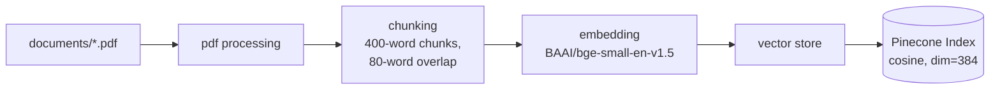
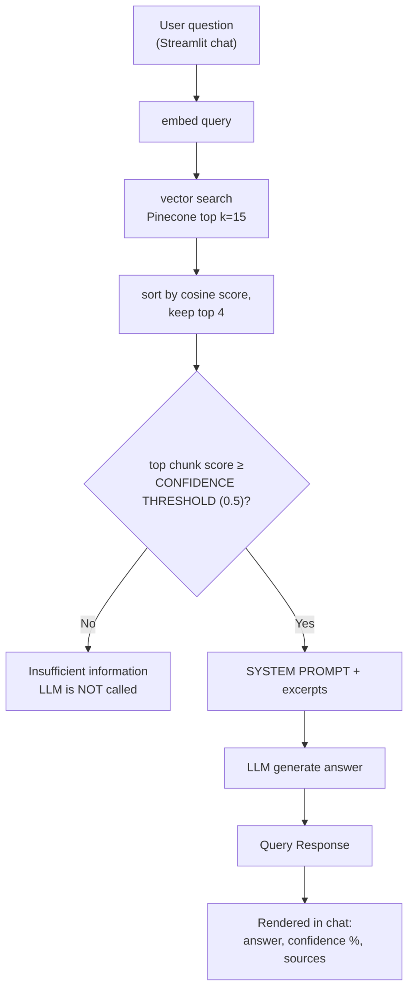

# Enterprise AI Assistant for Partex-Star-Group Employee Onboarding & HR Policies

A Retrieval-Augmented Generation (RAG) assistant that helps employees understand company onboarding procedures, internal HR
policies, and applicable Bangladesh Labour Law by answering natural-language
questions against two reference documents:

1. **A Handbook on the Bangladesh Labour Act 2006** 
2. **Partex-Star-Group Employee Handbook** 

Answers are **grounded strictly in these source documents**, with
document + page-level citations and a confidence score — and a clear
"I don't know" instead of a fabricated answer when neither document covers
the question.

**Live Demo:** [Enterprise AI Document Assistant · Streamlit](https://enterprise-ai-document-assistant-ncgcrggyu9g9slypepnwuu.streamlit.app/)

> **Known issue — Microsoft Edge:** the app can load as a blank white page
> under the header bar on Microsoft Edge. **It renders correctly
> on every other browsers**. On Edge, clicking
> **Manage app** (bottom right) fixes the problems. This appears to be an Edge-specific
> Streamlit Cloud iframe rendering quirk, **not an application bug** — the
> backend and UI logic work identically once rendered.
>


---

## Table of Contents

- [Project Overview](#project-overview)
- [Architecture](#architecture)
- [Tech Stack](#tech-stack)
- [Project Structure](#project-structure)
- [Setup & Installation](#setup--installation)
- [Running the App](#running-the-app)
- [Deployment](#deployment)
- [API Reference](#api-reference)
- [Configuration Reference](#configuration-reference)
- [Assumptions](#assumptions)
- [Limitations](#limitations)
- [Possible Future Improvements](#possible-future-improvements)

---

## Project Overview

**Problem:** New and existing Partex-Star-Group employees need quick,
reliable answers about onboarding steps, internal HR policy, and their
statutory rights under Bangladesh Labour Law — but these live across a
lengthy government labour act handbook and a separate internal company
handbook, neither of which is quick to search manually.

**Solution:** A RAG pipeline that:

1. Extracts and chunks all provided PDFs once (offline ingestion).
2. Embeds each chunk and stores it in a vector database (Pinecone).
3. At query time, embeds the user's question, retrieves the most similar
   chunks, and gates on a confidence score — if the evidence is too weak,
   the assistant says so **without calling the LLM at all**.
4. If confidence is sufficient, sends the retrieved excerpts to an LLM
   (Groq) with a strict grounding system prompt, and returns the answer
   with document name + page number citations.

The system is conversational (multi-turn, session-based follow-up
questions) and served through a single Streamlit chat interface.

---

## Architecture

The pipeline has two independent phases:

### 1. Ingestion (offline, run once via `python -m scripts.ingest`)



Each vector is stored with metadata: `source document name`, `page_start`,
`page_end`.

### 2. Query time (retrieval → confidence gate → generation)




---

## Tech Stack

| Layer | Choice | Why |
|---|---|---|
| PDF extraction | PyMuPDF (`fitz`) | Fast, reliable text extraction with per-page granularity for citations |
| OCR fallback | Tesseract (via `pytesseract`) | Some pages in the labour act handbook have no native text layer (scanned/image pages); these are rasterized and OCR'd automatically, with per-page confidence tracked for quality review |
| Embedding model | `BAAI/bge-small-en-v1.5` (Sentence-Transformers) | Strong open-source retrieval embedding, small enough (384-dim) to run on CPU |
| Vector database | Pinecone (Serverless, AWS) | Managed, no infra to run, generous free tier |
| LLM | Groq API (`llama-4-scout-17b-16e-instruct` primary, with fallback chain) | Very low latency inference; fallback chain protects against rate limits/outages |
| Backend framework | FastAPI | Typed request/response contracts via Pydantic |
| Frontend | Streamlit | Fast to build a chat UI; doubles as the deployment target (see [Deployment](#deployment)) |

---

## Project Structure

```
enterprise-ai-document-assistant/
├── app/
│   ├── main.py                  # FastAPI entrypoint (local/dev use)
│   ├── api/routes.py            # /query, /health, /documents endpoints
│   ├── core/config.py           # centralized settings (env-driven)
│   ├── core/logging_config.py   # structured logging setup
│   ├── models/schemas.py        # pydantic API contracts + internal dataclasses
│   ├── services/
│   │   ├── pdf_processor.py     # PDF → per-page text
│   │   ├── chunker.py           # per-page text → overlapping chunks
│   │   ├── embedder.py          # BGE embeddings (passage + query modes)
│   │   ├── vector_store.py      # Pinecone index lifecycle, upsert, search
│   │   ├── retriever.py         # query → top-k chunks (cosine similarity)
│   │   ├── memory.py            # in-process session/conversation memory
│   │   ├── llm_service.py       # Groq call + model fallback chain
│   │   └── rag_pipeline.py      # orchestrates retrieval → gate → generation
│   └── prompts/templates.py     # system prompt + context formatting
├── scripts/ingest.py            # one-time/re-runnable indexing script
├── documents/                   # source PDFs
├── frontend/streamlit_app.py    # chat UI (also the deployed entrypoint)
├── tests/
├── .env.example
├── .gitignore
├── requirements.txt
└── README.md
```

---

## Setup & Installation

### Prerequisites

- Python 3.11+
- A [Pinecone](https://www.pinecone.io/) account (free tier is enough) and API key
- A [Groq](https://console.groq.com/) account and API key

### System dependency for ingestion (OCR fallback)

Some pages in the Bangladesh Labour Act handbook have no extractable native
text layer (scanned pages) and require OCR during ingestion. Install
Tesseract OCR **before** running `scripts/ingest.py`:

- **Windows:** https://github.com/UB-Mannheim/tesseract/wiki
- **Ubuntu/Debian:** `sudo apt-get install tesseract-ocr`

This is only required for the local ingestion step — the deployed app
never runs OCR itself; it only queries an already-populated Pinecone index.

### Install

```bash
git clone <repo-url>
cd Enterprise-AI-Document-Assistant
python -m venv .venv && .\.venv\Scripts\Activate.ps1 
pip install -r requirements.txt
```

### Configure environment

```bash
cp .env.example .env
```

Edit `.env`:

```
PINECONE_API_KEY=your_pinecone_key
GROQ_API_KEY=your_groq_key
```

### Ingest documents (one-time)

Place all PDFs in `documents/`, then run:

```bash
python -m scripts.ingest
```

This creates the Pinecone index (if it doesn't already exist), extracts +
chunks + embeds every PDF, and upserts the vectors. Re-run this any time
`documents/` changes.

---

## Running the App

### Option 1 — Full stack (demonstrates the FastAPI API layer)

Move `streamlit_frontend.py` from the `tests` folder to the `frontend` folder.

```bash
# Terminal 1 — Backend
uvicorn app.main:app --reload --port 8080

# Terminal 2 — Frontend
streamlit run frontend/streamlit_frontend.py
```

Swagger docs available at `http://127.0.0.1:8080/docs`.

### Option 2 — Streamlit-only (matches the deployed version)

```bash
streamlit run frontend/streamlit_app.py
```

In this mode `frontend/streamlit_app.py` imports `rag_pipeline` and
`vector_store` directly and calls them in-process — it does not make HTTP
calls to the FastAPI app at all. Both entrypoints share the exact same
`app/services/*` code; nothing in the service layer changes between the two
modes.

---

## Deployment

**Deployed as a single Streamlit app** (frontend + backend logic in one
process). This was a deliberate change from the original two-service
design (FastAPI + Streamlit) — see [Assumptions](#assumptions) for the
reasoning.

Ingestion (`python -m scripts.ingest`) is run **locally**, against the same
Pinecone index the deployed app reads from — the deployed app never
re-ingests documents itself, it only queries an already-populated index.


---

## API Reference

The FastAPI layer (`app/main.py`, `app/api/routes.py`) exposes:

| Method | Path | Description |
|---|---|---|
| `POST` | `/query` | Ask a question. Body: `{"question": str, "session_id": str \| null}`. Returns `QueryResponse` (answer, confidence, sources, session_id, session_title, llm_model_used). |
| `GET` | `/health` | Reports Pinecone connectivity and indexed vector count. |
| `GET` | `/documents` | Returns total indexed chunk count. |
| `GET` | `/` | Landing route confirming the API is up. |

---

## Configuration Reference

All settings live in `app/core/config.py` and are overridable via `.env` /
environment variables:

| Setting | Default | Purpose |
|---|---|---|
| `CHUNK_SIZE_WORDS` | 400 | Words per chunk |
| `CHUNK_OVERLAP_WORDS` | 80 | Overlap between consecutive chunks |
| `EMBEDDING_MODEL_NAME` | `BAAI/bge-small-en-v1.5` | Embedding model |
| `EMBEDDING_DIM` | 384 | Must match the embedding model's output dim |
| `TOP_K_RETRIEVE` | 15 | Candidates pulled from Pinecone per query |
| `TOP_K_CONTEXT` | 4 | Top-N by cosine similarity sent to the LLM as context |
| `CONFIDENCE_THRESHOLD` | 0.5 | Minimum top-chunk cosine score to call the LLM at all |
| `GROQ_MODEL_PRIMARY` | `meta-llama/llama-4-scout-17b-16e-instruct` | Primary generation model |
| `GROQ_MODEL_FALLBACKS` | `llama-3.3-70b-versatile`, `llama-3.1-8b-instant` | Tried in order if the primary fails |
| `LLM_TEMPERATURE` | 0.1 | Lower = more deterministic, factual answers |
| `MAX_CONVERSATION_TURNS` | 6 | Turns kept per session |


---

## Assumptions

- **Streamlit-only deployment, not FastAPI + Streamlit.** The original
  design ran FastAPI as a separate backend service with Streamlit as a
  thin HTTP client. On the intended free hosting tier, the FastAPI
  service (loading `torch` + `sentence-transformers` for embeddings)
  consistently exceeded the platform's (`Render`) 512MB memory limit and crashed on
  startup. Rather than fight that constraint, the architecture was
  simplified: `frontend/streamlit_app.py` now imports the exact same
  `app/services/rag_pipeline.py` and calls it in-process. No service-layer
  code changed to support this — only the frontend's two API-calling
  functions were swapped for direct function calls. The FastAPI layer
  (`app/main.py`, `app/api/routes.py`) is untouched and still fully
  functional for local development and demonstrates the API design
  independently of the hosted deployment.
- **No cross-encoder reranker.** An earlier version of this pipeline used
  a `sentence-transformers` `CrossEncoder` to rerank Pinecone's candidates
  before computing confidence. It was removed in favor of using Pinecone's
  raw cosine similarity directly, to keep memory usage and cold-start time
  low on constrained hosting. This trades some retrieval precision for a
  lighter, faster-loading service — see [Limitations](#limitations).
- **Ingestion is a separate, manual step**, not run automatically on app
  startup or on a schedule. This keeps the deployed app's startup fast and
  avoids accidentally re-embedding documents on every restart.
- **Session/conversation memory is in-process** (a plain dict in
  `app/services/memory.py`), scoped to a single running instance.
- **`.env.example` keys are treated case-insensitively** by
  `pydantic-settings` (Pydantic's default), so `pinecone_api_key` in
  `.env` correctly populates `Settings.PINECONE_API_KEY`.
- **OCR fallback assumes Tesseract is available in the ingestion
  environment.** The Bangladesh Labour Act handbook contains some
  scanned/image-only pages with no native text layer; `pdf_processor.py`
  detects these (native text below `OCR_MIN_CHARS`) and OCRs them
  automatically. This only runs during local ingestion, never in the
  deployed app.

---

## Limitations

- **No cross-encoder reranking** means retrieval precision relies entirely
  on bi-encoder (BGE) cosine similarity, which is coarser than a
  cross-encoder's joint query-passage scoring. On ambiguous or
  multi-topic questions, the top-4 chunks may include a lower-relevance
  result that a reranker would have filtered out.
- **The "insufficient information" safeguard depends on exact string
  matching.** `rag_pipeline.py` strips sources when the LLM's answer text
  equals `NO_INFO_MESSAGE` character-for-character. If the LLM paraphrases
  its refusal instead of using the exact string from the system prompt,
  this check silently fails to strip sources, and the UI could show
  document citations next to an answer that isn't actually grounded in
  them. `temperature=0.1` (not 0) means this refusal behavior is not
  fully deterministic between identical queries.
- **In-process session memory is not persistent or multi-instance-safe.**
  It resets on every app restart and would need a shared store (e.g.
  Redis) to work correctly behind more than one running instance.
- **No authentication.** The `/query` endpoint (and the deployed Streamlit
  app) is open to anyone with the URL — acceptable for this assessment,
  not for a real production rollout.
- **Cold start latency.** First query after a restart is slower while the
  BGE embedding model loads into memory.
- **English-only.** No multilingual handling in chunking, embedding, or
  the system prompt.
- **OCR-extracted text quality varies with scan quality.** Pages recovered
  via OCR (rather than native PDF text) may contain minor transcription
  errors depending on the source scan's clarity; per-page OCR confidence
  is logged during ingestion so low-confidence pages can be manually
  spot-checked, but this isn't enforced automatically at query time.

---

## Possible Future Improvements

- Reintroduce reranking via a lighter ONNX-based cross-encoder (e.g. via
  `fastembed`) to regain precision without torch's memory footprint.
- Move session memory to Redis for multi-instance deployments.
- Add basic auth / API key gating on `/query`.
- Add automated ingestion on document upload (e.g. a `/documents/upload`
  endpoint) instead of the manual CLI script.
- Add a BM25 (sparse/keyword) retrieval path alongside the current dense
  embedding search, combined via hybrid scoring — this would help with
  exact-term queries (e.g. specific labour act section numbers or defined
  terms) where keyword overlap matters more than semantic similarity.

---

## 💬 Sample Questions

Not sure where to start? Try asking the assistant things like:

- What is the probation period for a clerical worker?
- What are the classification categories for workers?
- Under what condition can a probationer's period be extended under the Act?
- What is the mandatory notice period required for a permanent employee to resign?
- If a worker is laid off due to a sudden shortage of raw materials, are they entitled to compensation during the first 45 days?
- What is the statutory entitlement for Festival Holidays each year?

The assistant answers strictly from the indexed documents (Bangladesh Labour Act 2006 and the company employee handbook) — if something isn't covered in those documents, it will say so rather than guessing.
